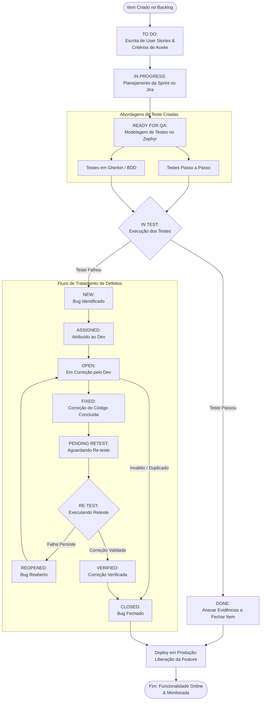

# 🏥 Projeto de Gerenciamento de Testes - Plataforma de Telemedicina

Desafio de projeto focado no mapeamento de requisitos, garantia de qualidade (QA) e estruturação de testes para um ecossistema de saúde, simulando o cenário real de desenvolvimento de uma plataforma de Telemedicina.

---

## 🛠️ Ferramentas e Metodologia

* **Jira:** Gerenciamento do projeto utilizando a metodologia ágil **Scrum** (Organização do Backlog e acompanhamento de itens através de Sprints).
* **Confluence:** Centralização da documentação e escrita das User Stories.
* **Zephyr Scale:** Criação, organização em pastas e estruturação dos Casos de Teste (CTs).

---

## 📂 Estrutura do Repositório e Artefatos

Os documentos oficiais gerados durante as etapas do desafio estão organizados na pasta raiz deste repositório:

* 📄 **`user-stories.pdf`**: Contém o mapeamento completo das User Stories, regras de negócio e critérios de aceite estruturados no Confluence.
* 📄 **`plano-de-testes-zephyr.pdf`**: Relatório contendo todos os Casos de Teste detalhados, cobrindo os formatos *Step-by-Step* (Passo a Passo) e cenários escritos em *BDD (Gherkin)*.
* 📸 **`print_quadro_sprint_jira.png`**: Captura de tela do quadro da Sprint Ativa no Jira, demonstrando o fluxo de trabalho dos cards.

---

## 📝 Escopo dos Testes Mapeados

### 🧪 Casos de Teste: Passo a Passo (Step-by-Step)
1. **Validar bloqueio de conta após 5 tentativas inválidas consecutivas**: Garante a segurança de acesso dos profissionais de saúde bloqueando o login suspeito.
2. **Validar encerramento de sessão após 5 minutos de ociosidade**: Garante o sigilo médico desconectando sessões inativas automaticamente.

### 🥒 Casos de Teste: BDD (Gherkin)
1. **Validar restrição de login com e-mail pessoal**: Cenário híbrido (palavras-chave em inglês e texto em português) validando o bloqueio de e-mails corporativos inválidos.
2. **Cancelamento de consulta antes de 24 horas de antecedência**: Validação de regra de negócio para cancelamento autônomo por parte do paciente sem cobrança de taxas.

---

## 🚀 Como Visualizar os Resultados

1. Acesse os arquivos PDF listados no repositório para conferir a formatação oficial exportada do ecossistema Atlassian.
2. Os critérios de aceite em BDD foram validados seguindo as restrições de sintaxe do interpretador nativo do Zephyr Scale (omitindo as tags de cabeçalho `Feature` e `Scenario` conforme especificação técnica da ferramenta).

---

## 🗺️ Fluxograma de Engenharia: Fluxos e Status de Trabalho (Workflow)

O diagrama abaixo mapeia a esteira técnica de estados de uma tarefa dentro de um ciclo de desenvolvimento ágil, detalhando o comportamento padrão de um item de Backlog e as ramificações de transição de um defeito (Bug/Defect Life Cycle).

## 💻 Autor
👋 Desenvolvido por **Jõao Vitor Zanca** durante o Desafio de Gerenciamento de Testes em Telemedicina.
